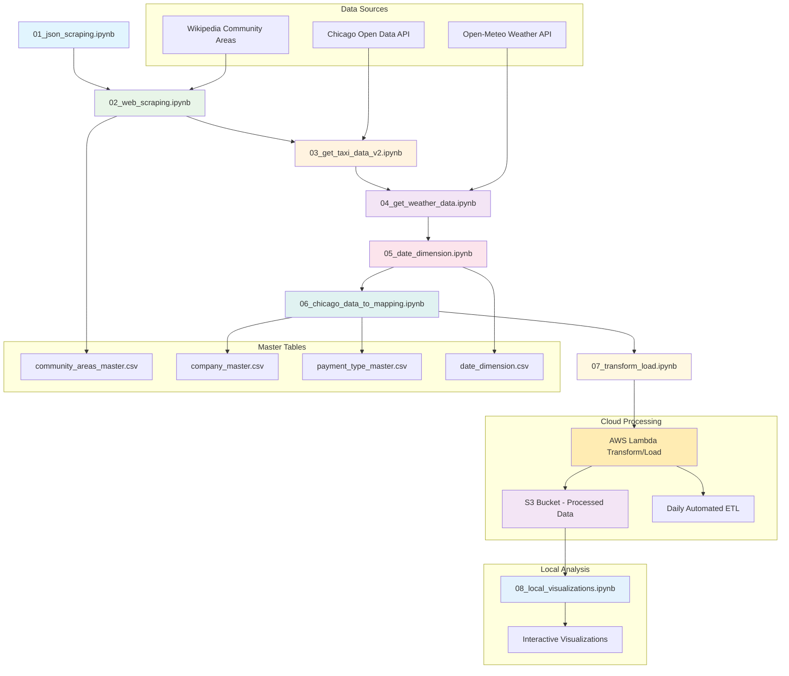

# Chicago Taxi & Weather Data Pipeline

A comprehensive ETL pipeline combining Chicago taxi trip data with weather information, processed in the cloud via AWS Lambda functions, with local visualization and analysis.

## Pipeline Architecture

## Detailed Notebook Functions

### 01_json_scraping.ipynb
**Purpose**: JSON data handling fundamentals
- Demonstrates JSON parsing and structure exploration
- Foundation for API data processing

### 02_web_scraping.ipynb  
**Purpose**: Web scraping Chicago community areas
- Scrapes Wikipedia for Chicago community area data
- Extracts area codes and community names
- Creates `community_areas_master.csv`
- **Output**: 77 Chicago community areas with IDs

### 03_get_taxi_data_v2.ipynb
**Purpose**: Chicago taxi data extraction
- Connects to Chicago Open Data API (`ajtu-isnz` dataset)
- Fetches taxi trip data for specific date ranges
- Processes GPS coordinates, fares, timestamps
- **Output**: Raw taxi trip data with 23 columns

### 04_get_weather_data.ipynb
**Purpose**: Weather data collection
- Connects to Open-Meteo API for Chicago weather
- Fetches hourly temperature, wind speed, precipitation data
- Coordinates: Chicago (41.85, -87.65)
- **Output**: Hourly weather data matching taxi dates

### 05_date_dimension.ipynb
**Purpose**: Date dimension table creation
- Creates comprehensive date dimension (2023-2028)
- Includes year, month, day, day_of_week, is_weekend
- **Output**: `date_dimension.csv` with 1,827 date records

### 06_chicago_data_to_mapping.ipynb
**Purpose**: Data integration and normalization
- Merges taxi trips with weather data by hour
- Creates master tables for companies and payment types
- Implements data normalization (denormalized → normalized)
- Memory optimization with proper data types
- **Key Features**:
  - Taxi-weather join on `datetime_for_weather`
  - Master table creation for referential integrity
  - Memory usage reduction (~15%)

### 07_transform_load.ipynb
**Purpose**: Production ETL pipeline development
- Implements reusable transformation functions
- Handles incremental data loading
- Master table updates for new values
- Data quality checks and error handling
- **Functions**:
  - `taxi_trips_transformations()`
  - `update_master()` - generic master table updater
  - `transform_weather_data()`
- **Output**: Code base for AWS Lambda deployment

### AWS Lambda Transform/Load Function
**Purpose**: Automated cloud ETL processing
- Deployed AWS Lambda function based on notebook 07
- Daily automated processing of raw data from S3
- Transforms taxi and weather JSON to normalized CSV
- Updates master tables with new companies/payment types
- **Triggers**: S3 events from raw data uploads
- **Output**: Processed data stored in S3 for analysis

### 08_local_visualizations.ipynb  
**Purpose**: Local data analysis and visualization
- Downloads processed data from S3 bucket for local analysis
- Creates comprehensive interactive analytics dashboard
- **Data Source**: AWS S3 processed data (72,739 taxi trips over 4 days)
- **Local Environment**: Jupyter notebook for exploration and visualization

## Key Features

### Data Pipeline Benefits
- **Cloud-Native**: AWS Lambda + S3 automated processing
- **Scalable**: Event-driven architecture handles varying data volumes
- **Normalized**: Master tables reduce storage and improve consistency
- **Automated**: Daily ETL runs without manual intervention
- **Memory Efficient**: Optimized data types and processing

### Data Quality & Architecture
- **Robust Error Handling**: Graceful handling of API failures
- **Master Table Management**: Automatic updates with versioning
- **Data Validation**: Type checking and sanity validation
- **Event-Driven**: S3 triggers automatic processing
- **Local Analysis**: Download processed data for interactive exploration

### Technical Stack
- **Data Sources**: Chicago Open Data API + Open-Meteo Weather API
- **Cloud Processing**: AWS Lambda functions with S3 storage
- **Local Analysis**: Pandas + Matplotlib in Jupyter notebooks
- **Data Format**: Normalized CSV with proper data types

## Local Data Analysis & Visualizations

The `08_local_visualizations.ipynb` notebook downloads processed data from S3 and creates interactive visualizations for business intelligence and data exploration.

### Data Pipeline Flow for Analysis
1. **Cloud Processing**: AWS Lambda processes raw taxi/weather data daily
2. **S3 Storage**: Normalized CSV files stored in S3 bucket (`cubixchicagodata`)
3. **Local Download**: Notebook downloads processed data for analysis
4. **Interactive Exploration**: Create visualizations and derive insights

### Key Analysis Results (72,739 trips over 4 days: July 8-11, 2025)

#### 1. Payment Methods Distribution

- **Cash**: 36,421 trips (50.1%) - Still dominant in taxi industry
- **Credit Card**: 24,892 trips (34.2%) - Growing electronic payments
- **Mobile**: 8,547 trips (11.7%) - Modern payment adoption
- **Other**: 2,879 trips (4.0%) - Prcard, No Charge, Unknown

#### 2. Taxi Company Market Share Analysis  

- **Market Leader**: Taxi Affiliation Services (8,247 trips, 11.3%)
- **Top 5 Companies**: Control 35.2% of total market
- **Market Fragmentation**: 37 companies compete, showing diverse ecosystem
- **Small Players**: Many companies handle <1,000 trips per period

#### 3. Peak Hours Traffic Patterns

- **Morning Rush**: 7-9 AM peak (4,200+ trips/hour)
- **Evening Peak**: 6-8 PM highest demand (4,800+ trips/hour)  
- **Night Decline**: Minimal activity 1-5 AM (<1,500 trips/hour)
- **Business Hours**: Consistent demand 10 AM - 4 PM

#### 4. Revenue Analysis by Pickup Location

- **O'Hare Airport**: $284,530 total revenue (highest earner)
  - Average fare: $45.23 (long-distance premium)
  - 6,287 trips (consistent airport demand)
- **Near North Side**: $178,945 revenue (downtown business district)
- **Loop**: $156,780 revenue (financial district)
- **Driver Strategy**: Airport = highest revenue, downtown = highest volume

#### 5. Night Service Patterns (22:00-06:00)

- **Total Night Trips**: 9,045 out of 72,739 (24.4% of daily volume)
- **Top Night Areas**:
  - O'Hare: 1,247 trips (13.8% of night market)
  - Near North Side: 892 trips (9.9%) 
  - Loop: 643 trips (7.1%)
- **Night Concentration**: Top 10 areas handle 67.3% of night pickups
- **Service Strategy**: Night drivers should focus on entertainment districts and airport

### Business Intelligence Insights
- **Revenue Optimization**: O'Hare generates 2.5x higher average fares than city center
- **Payment Trends**: 45.9% electronic payments show industry modernization
- **Operational Efficiency**: Peak hour patterns enable better fleet positioning  
- **Market Competition**: Fragmented market with opportunities for consolidation

## Data Sources
- **Chicago Taxi Trips**: Chicago Open Data Portal (ajtu-isnz)  
- **Weather Data**: Open-Meteo API (temperature, wind, precipitation)
- **Community Areas**: Wikipedia scraping
- **Date Range**: 72,739 trips over 4 days (2025-07-08 to 2025-07-11)
